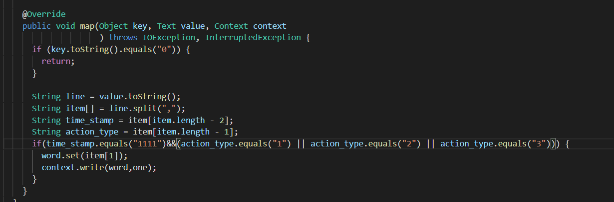
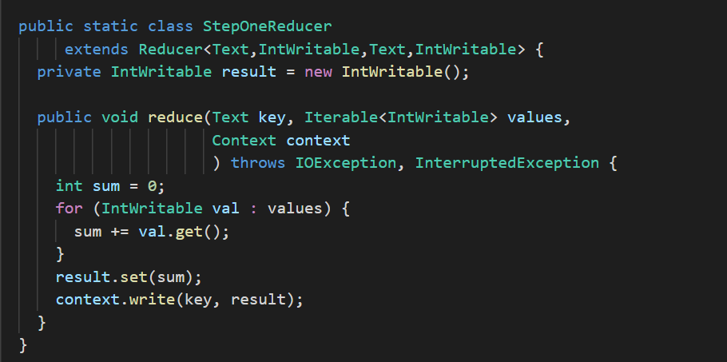
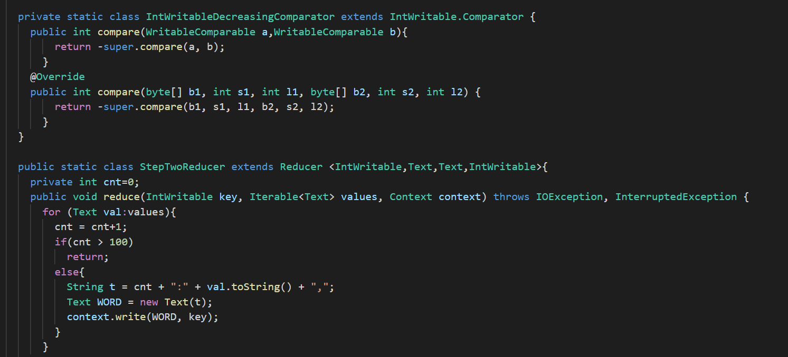
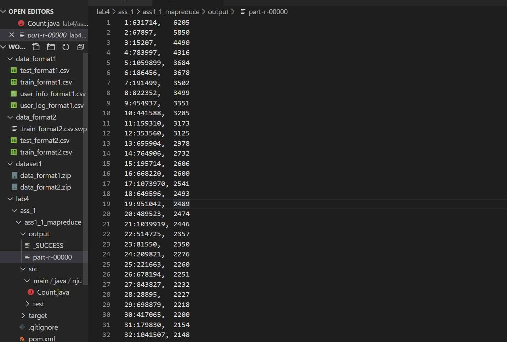
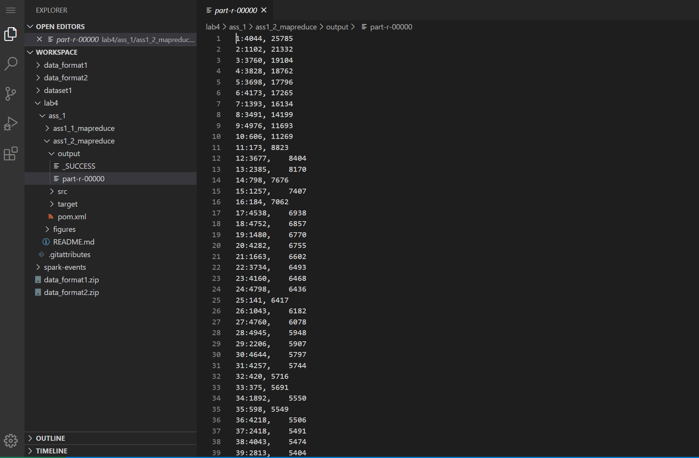

# 金融大数据 实验4 Assignment 1

####  吴泓宇 181250155

## MapReduce篇

### 统计最热门商品

该任务要求统计出“添加购物⻋+购买+添加收藏夹”前100名的商品，分析需求后，可以得出使用分类后的user_log数据比较好，因为其接近于nosql的存储方式有利于mapreduce的执行。然后就是编写程序，该程序和Wordcount差不多，排序部分之前的作业中也已经实现过。

唯一要注意的一点是csv文件的第一行数据需要忽略，实现方式为map函数中判断key是否为0，若为0则直接return即可

由于比较简单，直接给出代码：

第一个job的Mapper

第一个job的Reducer:

第二个job的比较器和Reducer，Mapper直接调用`InverseMapper.class`

### 实验结果 
如图，每一行输出的含义为 

名次：商品id， 总热度

### 统计最受年轻人关注的商家

该任务涉及到了年龄，如果再用分类的数据集，那就会涉及两个不同的文件，在MapReduce程序中不好处理，因此，我选择使用聚合的数据集`test_format2.csv`和`train_format2.csv`（这里统计所有的数据，不区分训练测试集）。

整体逻辑与统计热门商品类似，只不过具体实现上稍微复杂一点，要对一行字符串做两次split，才能得到具体的日志数据。

体现在代码上，只需要修改第一个job的Mapper即可，其余部分都不用做修改

### 实验结果

如图，每一行输出的含义为 

名次：商家id， 总热度

## 总结
