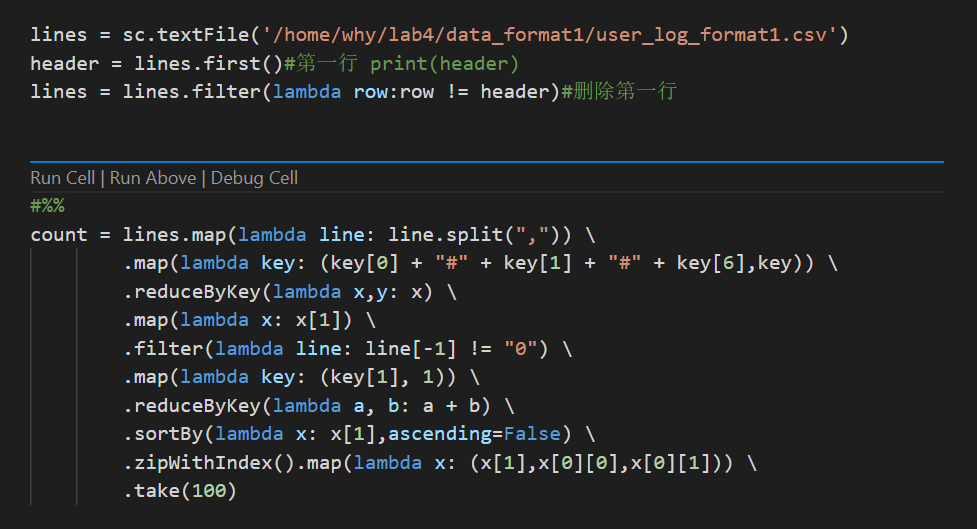
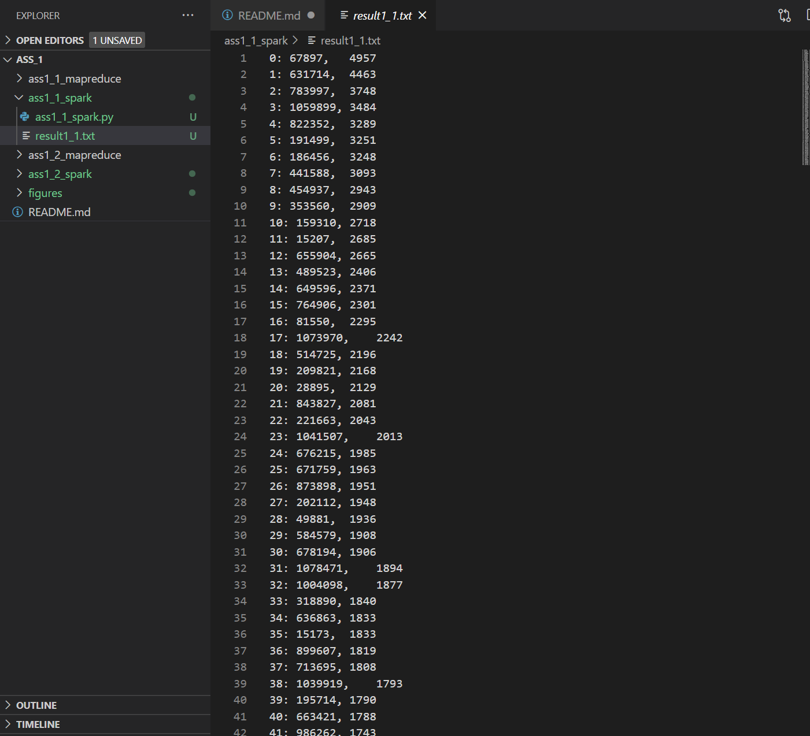
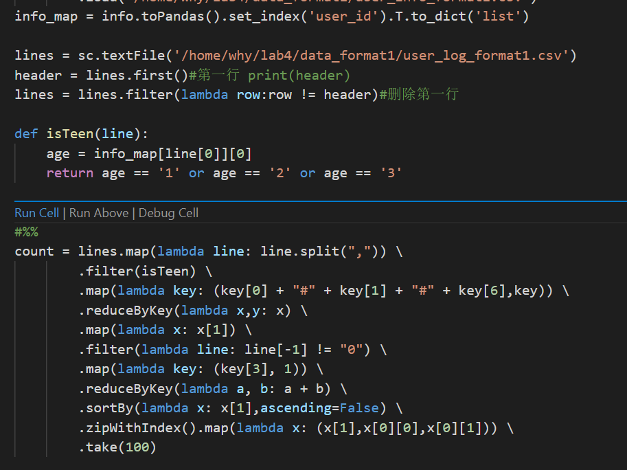

# 金融大数据 实验4 Assignment 1

####  吴泓宇 181250155

## MapReduce篇

### 统计最热门商品

该任务要求统计出“添加购物⻋+购买+添加收藏夹”前100名的商品，分析需求后，可以得出使用分类后的user_log数据比较好，因为其接近于nosql的存储方式有利于mapreduce的执行。然后就是编写程序，该程序和Wordcount差不多，排序部分之前的作业中也已经实现过。

唯一要注意的一点是csv文件的第一行数据需要忽略，实现方式为map函数中判断key是否为0，若为0则直接return即可

由于比较简单，直接给出代码：

第一个job的Mapper

第一个job的Reducer:

第二个job的比较器和Reducer，Mapper直接调用`InverseMapper.class`

### 实验结果 
如图，每一行输出的含义为 

名次：商品id， 总热度

### 统计最受年轻人关注的商家

该任务涉及到了年龄，如果再用分类的数据集，那就会涉及两个不同的文件，在MapReduce程序中不好处理，因此，我选择使用聚合的数据集`test_format2.csv`和`train_format2.csv`（这里统计所有的数据，不区分训练测试集）。

整体逻辑与统计热门商品类似，只不过具体实现上稍微复杂一点，要对一行字符串做两次split，才能得到具体的日志数据。

体现在代码上，只需要修改第一个job的Mapper即可，其余部分都不用做修改

### 实验结果

如图，每一行输出的含义为 

名次：商家id， 总热度

## Spark篇

### 统计最热门商品

编写Spark代码比Hadoop MapReduce方便了许多，核心代码甚至只需要一行就能完成，这也是函数式编程的特点，由于有python基础，我选择了pyspark编程。

核心代码如下：

在去掉首行后，先用一个`map`将每行分割，然后进行**去重**,去重的思想是，将每条记录的user_id, item_id, action拼接起来作为新的key，原来一整行作为value，然后用`reduceBykey`去重（即只保留一个），再用一个map将value提取出来即可。全程只调用了三个transform，非常方便。

接下来的逻辑和之前类似，用`filter`将action为0的行过滤掉，然后用item_id作为key进行一次wordcount即可，计数之后要进行排序，spark也提供了sortBy操作，可以对指定的列进行排序，取前100个也可以用take(100)轻松完成

到此任务就完成了，接下来就是一些写文件的操作，总的来说体验非常好。

### 实验结果

可以发现，过滤掉同一用户的疑似刷数据行为后，排行榜略有改变

### 统计最受年轻人关注的商家

这部分的逻辑和hadoop mapreduce有些不同，函数式编程无法像mapreduce那样轻松将一行数据不断拆解，因此我调整思路，先把user_info_format.csv中的数据读进spark sql里，然后尝试用`filter`向sql中请求age信息来过滤，但是没有成功。因为spark禁止在filter操作里对spark sql dataframe进行操作，这样会造成非常大的性能损失。因此我先将其存进一个dict里，在`filter`时直接用dict进行年龄过滤，成功。

代码如下：

`isTeen`函数用来判断该用户是否是年轻人，被传进了`filter`操作里，其余逻辑类似，不再赘述

### 实验结果

这次结果有一点意外，与去重之前相比，虽然数据上发生了变动，但排行榜的**前十五名**几乎没有发生变化，靠后的商家的排名也只是上下五名浮动。分析结果可以得出这样的结论：

**大家都在刷数据！or 大家都没有刷数据！**

真相如何就是见仁见智了:)
