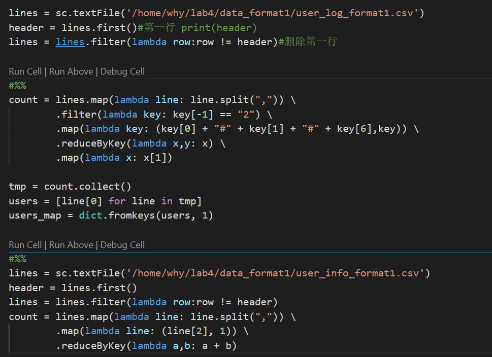
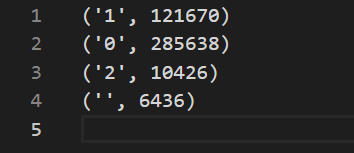
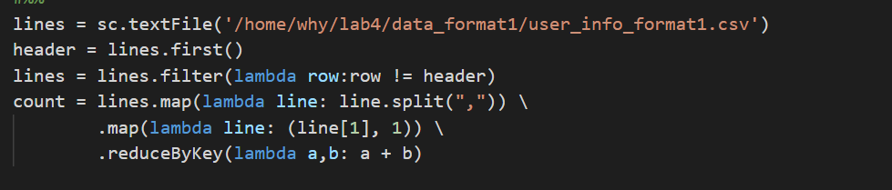
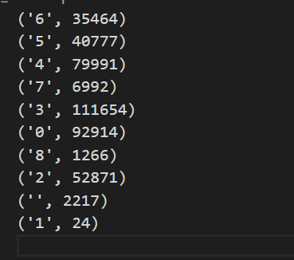

# 金融大数据 实验4 Assignment 2

####  吴泓宇 181250155

## 统计性别比和年龄比

我一开始的思路是：分成两个job，
- 第一个job先从user_log数据集里筛选出有过购买记录的用户的user_id并保存下来
- 第二个job在从user_info数据集里根据上一个job里得到的user_id筛选出有效的用户，在以Gender为key进行一次wordcount即可

根据以上思路，不难写出代码：

### 实验结果

0代表女性，1代表男性，" "和2代表未知

可已看出女男比约为**2.35**

*另外，通过加总这几个数字，我发现和恰好等于user_info的总行数，说明数据集里的每个用户都是购买了商品的，因此其实只要统计user_info一个数据集就可以了...*

因此，在统计年龄比例时，代码得以大幅度精简：

### 实验结果

