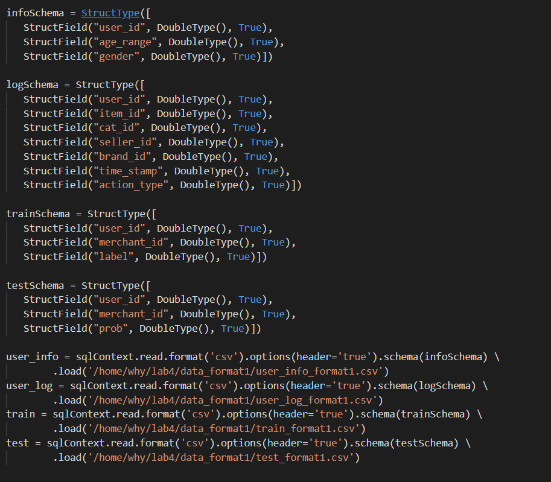
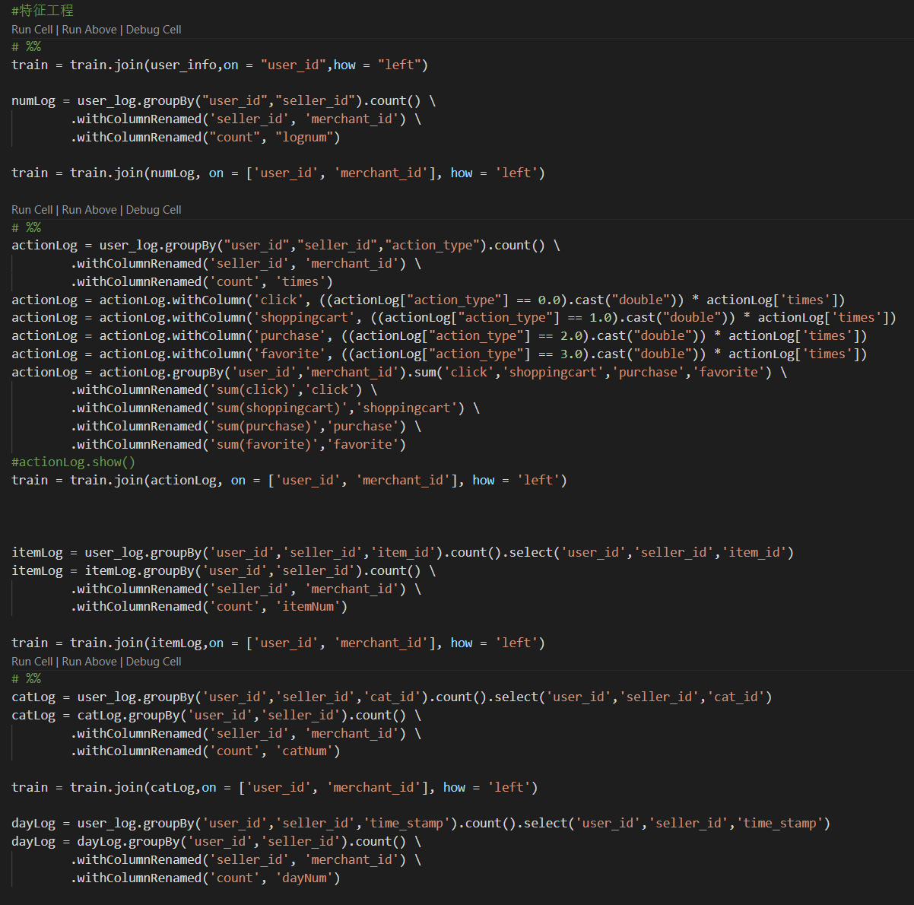
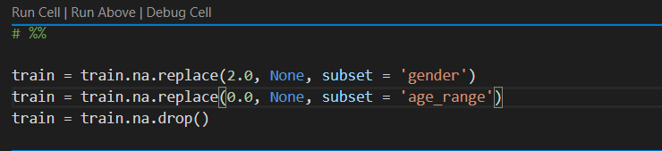
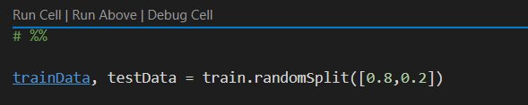
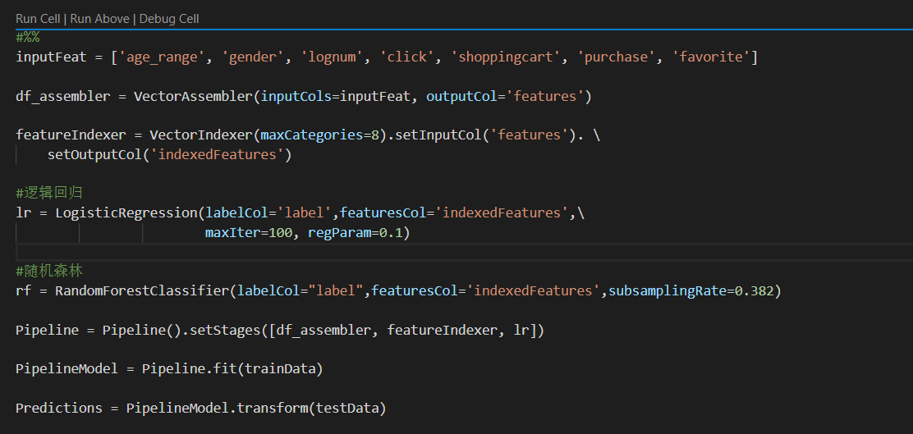
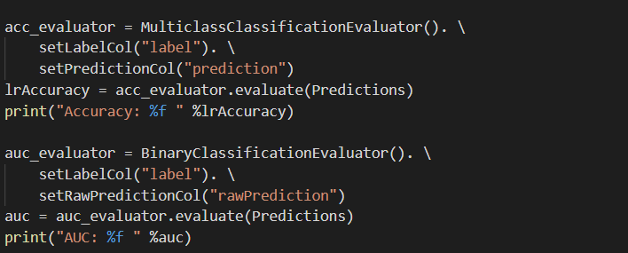
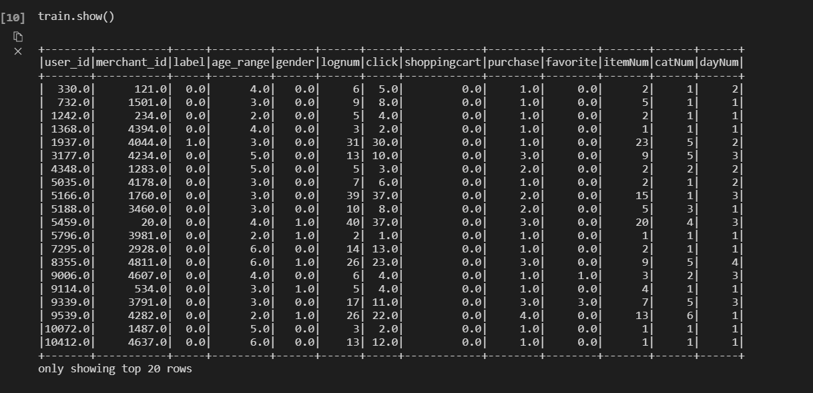
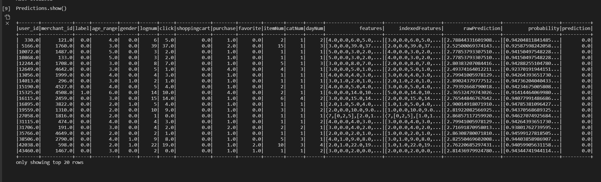
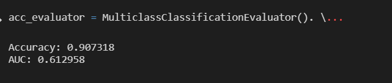

# 金融大数据 实验4 Assignment 3

####  吴泓宇 181250155

## 基于Spark MLlib编写程序预测回头客，评估实验结果的准确率

### 数据读取

Spark ML是基于`dataframe`的机器学习库，因此要读为`dataframe`形式。

但是，如果直接用sqlcontext读入的话，会将所有列的`type`都读成`String`，这显然不是我们想要的，查阅文档后，我了解到需要自定义读入时的`schema`,在读取时指定自己规定的`schema`即可，这里先将所有数据读为`double`

### 特征工程

特征工程主要涉及到对Sparksql dataframe的各种操作，如`groupBy`,`join`等，大多可以在pandas中找到对应的api，不过功能明显不如pandas强大，在这里我先提取了点击量、收藏量、购物车、购买、年龄、性别组、天数等作为试验。

### 异常和缺失值处理
对于缺失值和异常值，我选择了直接舍弃（因为spark sql甚至没有一个能向前向后填充的api...）

### 训练模型

首先，划分训练集和测试集

然后，构建我们的`Pipeline`

首先，`SparkML`是不能直接对`dataframe`进行训练的，因此我们需要先用`VectorAssembler`将我们的输入特征转化为特征向量

然后，由于我们读入数据的时候将所有列都读成了`double`类型，而显然对于类别变量而言这并不合适，因此我们需要将其转化为类别变量，这需要调用`SparkML`的`VectorIndexer`来实现

这之后，就是选择分类器了，我选择了逻辑回归分类器

最后只需要将这些元素放进一个`Pipeline`里就可以直接运行啦！先对训练集进行`fit`，再对测试集进行`transform`，非常方便

然后再调用`Evaluator`评估模型表现

### 实验结果

训练集：

预测结果：

表现：

### 分析与讨论

分析结果可以看出，虽然Accuracy很高，但是AUC却很低。这是因为原始数据是一个**类别不平衡**的数据，我在一开始的尝试时发现所有预测结果全都为0，而Accuracy依然很高，因此，我们的模型不能使用Accuracy作为评估指标，而应该使用AUC作为评价指标。

而且，由于虚拟机的性能限制，在伪分布的模式下训练一个模型非常的慢......而且相对于`sklearn`等成熟的机器学习框架而言，`SparkML`的实现还比较落后，我在国外某论坛上得到的评价是”只能充当一个baseline“使用。

出于这两点考虑，我在之后的调优以及参加比赛的平台就没有再使用SparkML，而是使用了`sklearn`中的`xgboost`等复杂框架。

--------------------------------

**截至目前，在天池的排名为85名（2020.12.25）**
